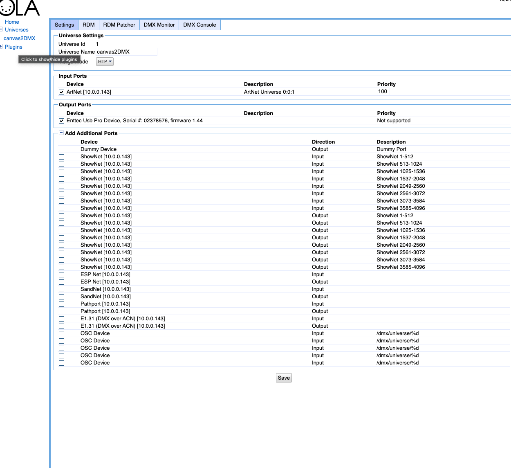
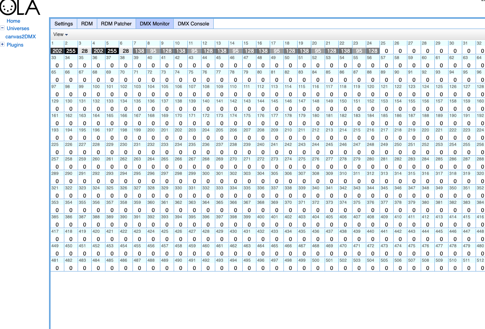

# 🚀 Getting Started with Canvas2DMX

Canvas2DMX lets you map pixels from your Processing sketch directly to DMX fixtures in real-time.  
This quickstart will guide you through installation and your first test sketch.

---

## 1. Requirements

- **Processing 4.x**
- **A USB DMX dongle** — see the table below to find your type
- macOS / Windows / Linux

### Which dongle do I have?

There are two families of USB DMX dongle and they need different libraries. Every example has a single flag — `USE_ENTTEC_PRO` — to switch between them.

| Dongle type | How to tell | Library | `USE_ENTTEC_PRO` |
|---|---|---|---|
| **ENTTEC USB Pro** (or compatible) | Has an onboard microcontroller; labeled "USB Pro", "DMX USB Pro", or "OpenDMX Pro" | **dmxP512** | `true` |
| **FT232RL "Open DMX"** | Cheap transparent USB cable; "USB to DMX 512 Interface Adapter" on Amazon; FreeStyler dongle; any dongle built around an FT232RL chip | **DMX4Artists** | `false` |
| **Art-Net / OLA** | You have Open Lighting Architecture installed as a middleware layer | artnet4j (UDP) | use `HardwareOLA` |

> **Why two separate libraries?**  
> The ENTTEC USB Pro has an onboard microcontroller and speaks a proprietary packet protocol — **dmxP512** handles that.  
> Cheap FT232RL dongles are dumb USB→RS485 adapters with no microcontroller; the computer generates raw DMX timing itself — **DMX4Artists** does that via the FTDI driver.  
> They are **not interchangeable**: dmxP512 will not work with an FT232RL dongle, and DMX4Artists will not work with an ENTTEC Pro.

---

## 2. Installation

1. Install **both** DMX libraries in Processing (all examples import both, so both must be present to compile):
   - Open Processing → `Sketch` → `Import Library` → `Add Library…`
   - Search for **dmxP512** (by Daniel Bonner) and install.
   - Search for **DMX4Artists** (by Jayson Haebich) and install.
   - You only use one at runtime, selected by the `USE_ENTTEC_PRO` flag in each sketch.

2. Download or clone the **Canvas2DMX** library:
   ```bash
   git clone https://github.com/jshaw/Canvas2DMX.git
   ```

3. Copy the built library folder into your Processing libraries directory:

   ```
   Documents/Processing/libraries/
   ```

4. Restart Processing.
   You should now see **Canvas2DMX** listed under `Sketch → Import Library`.

---

## 3. Your First Sketch

Open the **`Basics`** example (`File → Examples → Contributed Libraries → Canvas2DMX → Basics`) and update the config block at the top to match your setup:

```java
import com.studiojordanshaw.canvas2dmx.*;
import dmxP512.*;
import processing.serial.*;
import com.jaysonh.dmx4artists.*;

// ── Configure these for your setup ──────────────────────────────────────────
//
// USE_ENTTEC_PRO — which dongle type are you using?
//   true  → ENTTEC USB Pro — uses dmxP512 library, connects via DMX_PORT
//   false → FT232RL cheap dongle — uses DMX4Artists, auto-detected by USB index
//
boolean USE_ENTTEC_PRO     = true;

// DMX_PORT — serial port for ENTTEC Pro (only used when USE_ENTTEC_PRO=true).
//   To list all ports: add  println(Serial.list());  to setup() and run.
//   Mac: /dev/cu.usbserial-XXXXXXXX   Windows: COM3   Linux: /dev/ttyUSB0
String DMX_PORT            = "/dev/cu.usbserial-XXXXXXXX"; // ← change this

int    DMX_BAUDRATE        = 115000;  // ENTTEC Pro baud rate — do not change
int    DMX_UNIVERSE        = 512;     // full DMX universe; max 512 channels

// DMX_OFFSET — channel correction for dmxP512 (only used when USE_ENTTEC_PRO=true).
//   1 = standard for ENTTEC Pro  |  0 = if channels arrive one step too high
int    DMX_OFFSET          = 1;

// DMX_CHANNEL_PATTERN — must match your fixture’s channel map (check its manual).
//   d=dimmer  r=red  g=green  b=blue  w=white  s=strobe  c=color change macro
//   Common: "rgb"  "grb"  "drgb"  "drgbsc"  "rgbw"
String DMX_CHANNEL_PATTERN = "drgb"; // ← change this to match your fixture

// ────────────────────────────────────────────────────────────────────────────

Canvas2DMX c2d;
DmxP512 dmxPro;   // used when USE_ENTTEC_PRO = true
DMXControl dmxOpen; // used when USE_ENTTEC_PRO = false

void settings() { size(320, 220); pixelDensity(1); }

void setup() {
  if (USE_ENTTEC_PRO) {
    dmxPro = new DmxP512(this, DMX_UNIVERSE, false);
    dmxPro.setupDmxPro(DMX_PORT, DMX_BAUDRATE);
  } else {
    dmxOpen = new DMXControl(0, DMX_UNIVERSE); // 0 = first detected FT232RL device
  }
  c2d = new Canvas2DMX(this);
  c2d.setChannelPattern(DMX_CHANNEL_PATTERN);
  c2d.setDefaultValue(‘d’, 255);
  c2d.setStartAt(1);
  c2d.setLed(0, width/2, height/2);
}

void draw() {
  background(frameCount % 255, 100, 200);
  int[] colors = c2d.getLedColors();
  c2d.visualize(colors);
  c2d.showLedLocations();
  sendDmx();
}

// sendDmx() — branches on USE_ENTTEC_PRO to call the right library.
// This pattern is used in all Canvas2DMX examples.
void sendDmx() {
  if (USE_ENTTEC_PRO) {
    c2d.sendToDmx((ch, val) -> dmxPro.set(ch + DMX_OFFSET - 1, val));
  } else {
    c2d.sendToDmx((ch, val) -> dmxOpen.sendValue(ch, val));
  }
}
```

Run the sketch — you’ll see LED markers drawn over your canvas and a color swatch strip at the bottom. If your dongle is connected and configured correctly, the fixture will respond immediately.

### Finding your serial port (ENTTEC Pro)

Add this line to `setup()`, run the sketch, and check the Processing console:

```java
println(Serial.list());
```

On macOS the ENTTEC Pro typically appears as `/dev/cu.usbserial-XXXXXXXX`. Use the `cu.` prefix — not `tty.` — for outgoing serial connections.

---

---

## 4. Configuration Methods

Canvas2DMX provides several methods to configure how colors are sampled and sent to DMX:

### Canvas Size (Off-Screen Buffers)

```java
c2d.setCanvasSize(int width, int height);
```

Set custom canvas dimensions for LED mapping. **Use this when sampling from a `PGraphics` buffer** that has different dimensions than your sketch window. By default, Canvas2DMX uses the sketch's `width` and `height`.

### Channel Pattern

```java
c2d.setChannelPattern("drgb");  // dimmer + RGB
c2d.setChannelPattern("rgb");   // just RGB (default)
c2d.setChannelPattern("rgbw");  // RGB + white
```

### Default Values

```java
c2d.setDefaultValue('d', 255);  // dimmer at full
c2d.setDefaultValue('s', 0);    // strobe off
```

### Response Curve

```java
c2d.setResponse(2.2);           // gamma correction
c2d.setTemperature(-0.3);       // warm color shift
```

---

## 5. Working with Off-Screen Buffers

For advanced workflows, you can sample from a `PGraphics` buffer instead of the main canvas. This is useful when you want to keep LED mapping resolution independent from display resolution.

```java
import com.studiojordanshaw.canvas2dmx.*;

Canvas2DMX c2d;
PGraphics ledBuffer;

void setup() {
  size(800, 600);
  
  // Create a smaller buffer for LED sampling
  ledBuffer = createGraphics(100, 100);
  
  c2d = new Canvas2DMX(this);
  
  // IMPORTANT: Tell Canvas2DMX the buffer dimensions
  c2d.setCanvasSize(100, 100);
  
  // Map LEDs relative to buffer coordinates
  c2d.mapLedStrip(0, 10, 50, 50, 8, 0, false);
}

void draw() {
  // Draw to the off-screen buffer
  ledBuffer.beginDraw();
  ledBuffer.background(0);
  ledBuffer.fill(255, 100, 0);
  ledBuffer.ellipse(
    map(mouseX, 0, width, 0, 100),
    map(mouseY, 0, height, 0, 100),
    30, 30
  );
  ledBuffer.endDraw();
  
  // Display buffer scaled up to window
  image(ledBuffer, 0, 0, width, height);
  
  // Sample from the buffer's pixels
  ledBuffer.loadPixels();
  int[] colors = c2d.getLedColors(ledBuffer.pixels);
  
  c2d.visualize(colors);
}
```

### Key Points

- Call `setCanvasSize()` **before** mapping LEDs
- LED coordinates should be relative to the buffer size, not the window size
- Use `getLedColors(buffer.pixels)` to sample from the buffer
- Don't forget to call `buffer.loadPixels()` before sampling

---

## 6. Using OLA (Open Lighting Architecture)

OLA is middleware that sits between Processing and your USB dongle. Instead of talking to the dongle directly, your sketch sends **Art-Net UDP packets** to OLA on localhost — OLA then drives whatever hardware is patched to that universe. This means you can swap dongles without changing a line of code.

**Works with:** ENTTEC USB Pro, FT232RL Open DMX, and most other dongles.

### Setup

```bash
brew install ola        # macOS (Homebrew)
olad -l 3               # start the OLA daemon
```

Then open **http://localhost:9090** in a browser:

1. Click **Add Universe**, set Universe ID to `1`, name it anything (e.g. `canvas2DMX`)
2. Under **Input Ports**, tick **ArtNet** — it will show `ArtNet Universe 0:0:1`
3. Under **Output Ports**, tick your USB dongle (e.g. `Enttec Usb Pro Device`)
4. Click **Save**



### Running the HardwareOLA example

Open `File → Examples → Canvas2DMX → HardwareOLA` and set:

```java
int ART_NET_UNIVERSE = 1;   // match the Universe ID you created above
String DMX_CHANNEL_PATTERN = "grb";   // SP201E / WS2812/WS2815 raw strip
float DMX_RESPONSE = 2.6;             // gamma for linear LED chips
```

Run the sketch. Check the **DMX Monitor** tab in OLA — you should see live channel values updating as the animation runs:



Channels 1–24 show active GRB values for the 8-LED ring (3 channels × 8 LEDs). Everything above channel 24 stays at 0 — clean output with no leakage into unused channels.

### Why use OLA?

| Direct (dmxP512 / DMX4Artists) | Via OLA |
|---|---|
| One library per dongle type | Any dongle, same sketch |
| Serial port string in code | No port config needed |
| Swap dongle → change code | Swap dongle → repatch in browser |
| Works offline, no daemon | Requires `olad` running |

> **SP201E note:** the SP201E maps DMX channels directly to LED colour data, 3 channels per LED, with no dimmer or strobe channels. Always use `"grb"` or `"rgb"` — never `"drgb"` or `"drgbsc"` — otherwise the dimmer value shifts every LED's colour data and the strip outputs black.

---

## 7. Next Steps

Try the **examples** included with the library:

- `Basics` — the smallest possible sampling sketch
- `StripMapping` — linear layouts and DMX frame preview
- `OffscreenBuffer` — `PGraphics` workflows with `setCanvasSize()`
- `PolygonMapping` — arbitrary shapes and fill ordering
- `InteractiveDemo` — live fixture-pattern exploration

Check out:

- [Advanced Features](release.html) for packaging and release steps
- [Troubleshooting](troubleshooting.html) if your DMX isn’t working

---

✅ That’s it! You’re ready to build interactive Processing sketches that control DMX lighting in real time.

---

## 📚 Learn More

* **[Canvas2DMX](https://github.com/jshaw/Canvas2DMX)** — repo link
* [Getting Started](getting-started.html) — installation and first sketch
* [Troubleshooting](troubleshooting.html) — common issues and fixes
* [Develop](develop.html) — contributing and building from source
* [Release](release.html) — packaging and Processing Library Manager submission

---

## 📜 License

MIT License © 2025 [Studio Jordan Shaw](https://www.jordanshaw.com/)
