<div class="hero">
  <h1>Canvas2DMX</h1>
  <p>A Processing library for mapping canvas pixels to DMX lighting fixtures in real time. Define LED layouts, apply colour correction, and send to any DMX backend.</p>
  <div class="hero-actions">
    <a class="btn btn-primary" href="getting-started/">Get Started</a>
    <a class="btn btn-secondary" href="https://github.com/jshaw/Canvas2DMX">GitHub</a>
  </div>
</div>

<hr class="section-divider">

<p class="section-label">Features</p>

<ul class="feature-list">
  <li>Real-time canvas pixel sampling</li>
  <li>Strips, rings, grids, polygons</li>
  <li>Custom DMX channel patterns</li>
  <li>Gamma &amp; colour correction</li>
  <li>GRB chip support</li>
  <li>ENTTEC, FT232RL, OLA output</li>
  <li>Off-screen buffer support</li>
  <li>Live debug visualization</li>
</ul>

<hr class="section-divider">

<p class="section-label">Quick Start</p>

```java
import com.studiojordanshaw.canvas2dmx.*;

Canvas2DMX c2d;

void setup() {
  size(400, 200);
  pixelDensity(1);

  c2d = new Canvas2DMX(this);
  c2d.mapLedStrip(0, 8, width/2f, height/2f, 40, 0, false);
  c2d.setChannelPattern("grb");  // match your fixture
  c2d.setResponse(2.6);          // gamma for WS2812/WS2815
  c2d.setStartAt(1);
}

void draw() {
  background(0);
  ellipse(mouseX, mouseY, 100, 100);

  int[] colors = c2d.getLedColors();
  c2d.visualize(colors);

  // send via your backend — ENTTEC Pro, FT232RL, OLA, or your own
  c2d.sendToDmx((ch, val) -> dmx.sendValue(ch, val));
}
```

[Full setup guide →](getting-started.md)

<hr class="section-divider">

<p class="section-label">Made with Canvas2DMX</p>

<p>Installations by <a href="https://www.jordanshaw.com">Studio Jordan Shaw</a></p>

<div class="project-grid">

  <a class="project-card" href="https://www.jordanshaw.com/home/constellation-range">
    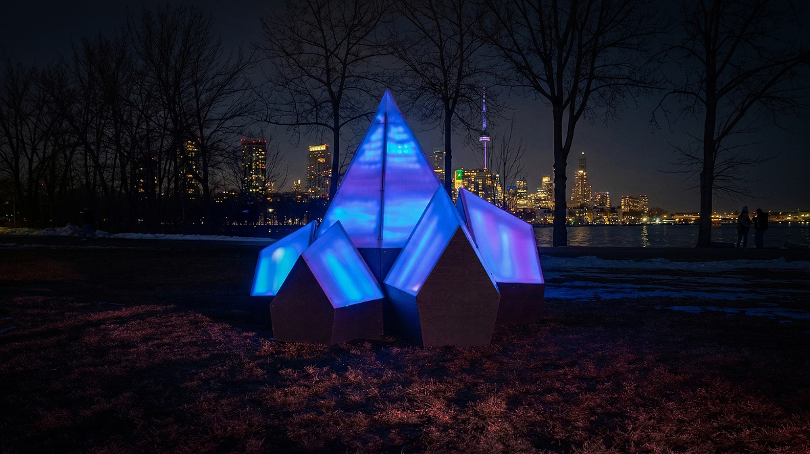
    <div class="project-card-body">
      <p class="project-card-title">Constellation Range</p>
      <p class="project-card-desc">Six illuminated faceted peaks with aurora gradients responding to Bluetooth proximity — OCAD U Gala 2026</p>
    </div>
  </a>

  <a class="project-card" href="https://www.jordanshaw.com/home/same-material-different-time">
    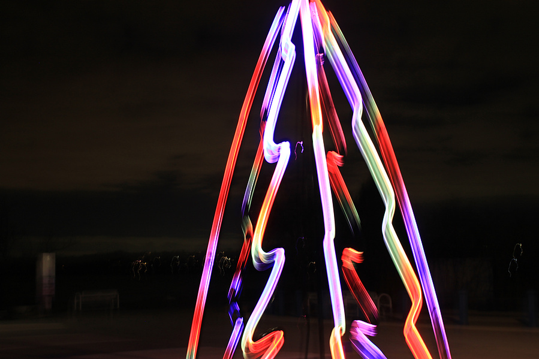
    <div class="project-card-body">
      <p class="project-card-title">Same Material / Different Time</p>
      <p class="project-card-desc">Anamorphic LED installation — addressable strips transform a tree into a sail through light and perspective</p>
    </div>
  </a>

  <a class="project-card" href="https://www.jordanshaw.com/home/crosshatch">
    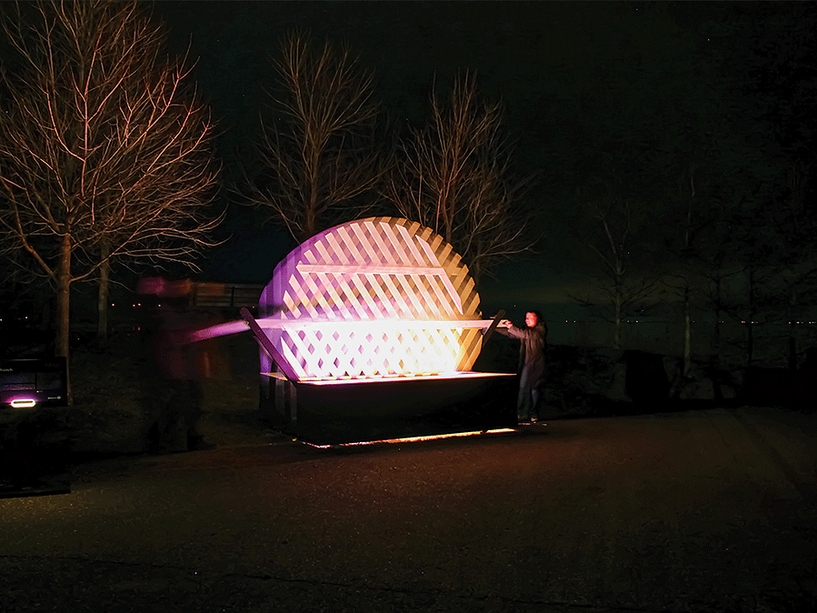
    <div class="project-card-body">
      <p class="project-card-title">Crosshatch</p>
      <p class="project-card-desc">Kinetic interactive installation — handles alter lighting, shadows, and projected patterns in real time</p>
    </div>
  </a>

  <a class="project-card" href="https://www.jordanshaw.com/home/signal">
    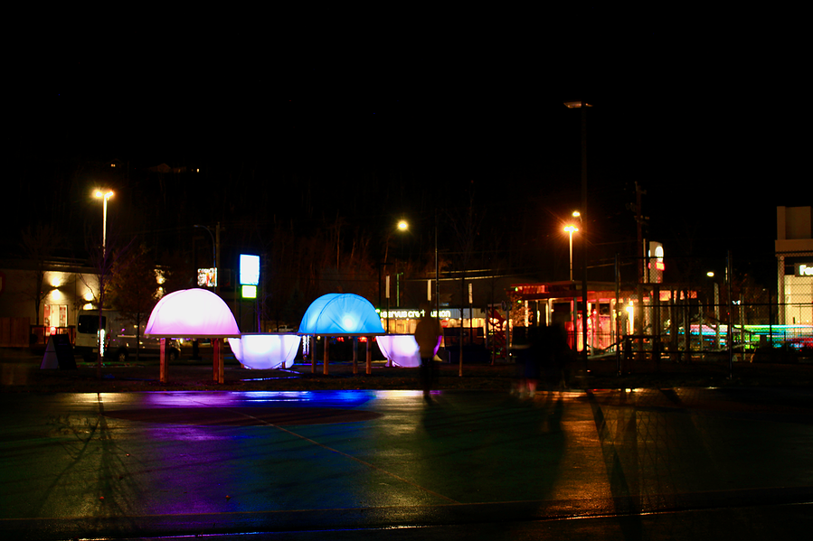
    <div class="project-card-body">
      <p class="project-card-title">Signal</p>
      <p class="project-card-desc">Interactive light sculpture driven by open weather data and visitor interaction</p>
    </div>
  </a>

  <a class="project-card" href="https://www.jordanshaw.com/home/rays">
    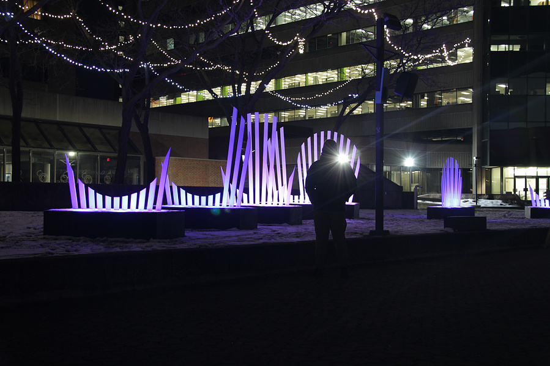
    <div class="project-card-body">
      <p class="project-card-title">Rays</p>
      <p class="project-card-desc">Infrared-interactive public light sculpture celebrating post-pandemic community reconnection — Hamilton</p>
    </div>
  </a>

</div>

<hr class="section-divider">

<p class="section-label">Examples</p>

<div class="gallery-grid">
  <div class="gallery-item">
    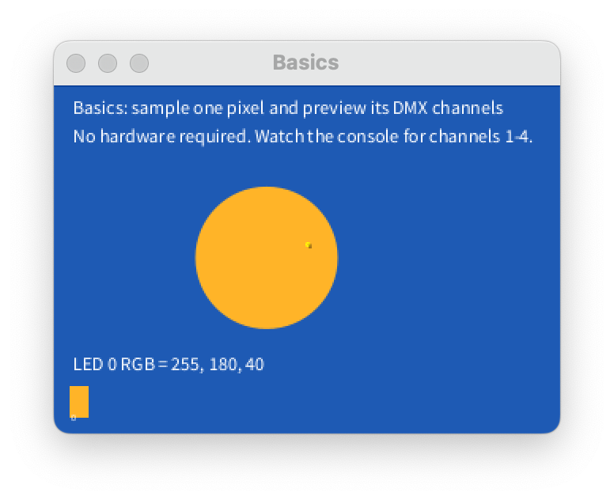
    <div class="gallery-item-label">Basics</div>
  </div>
  <div class="gallery-item">
    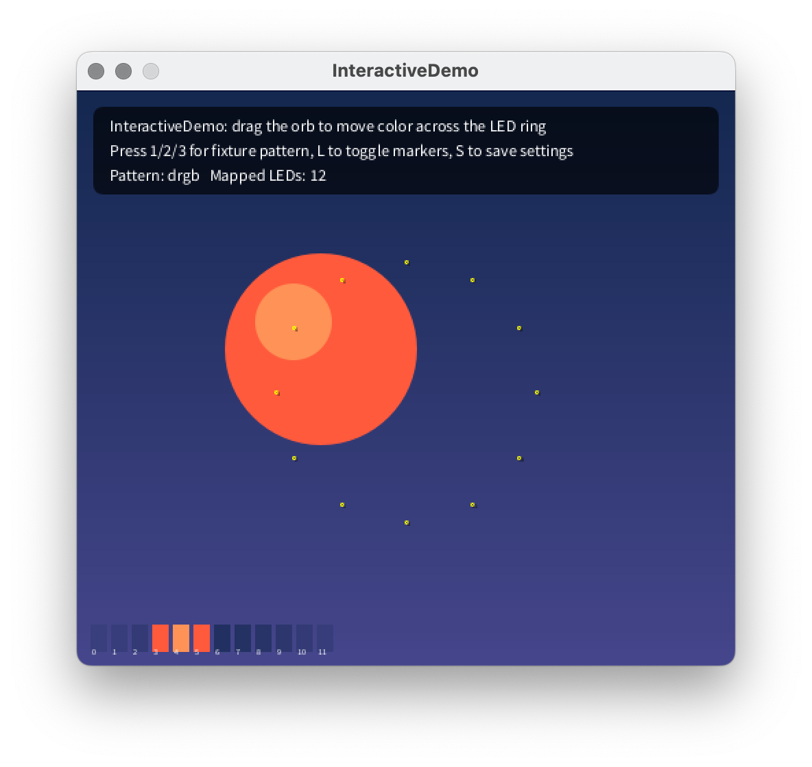
    <div class="gallery-item-label">Strip Mapping</div>
  </div>
  <div class="gallery-item">
    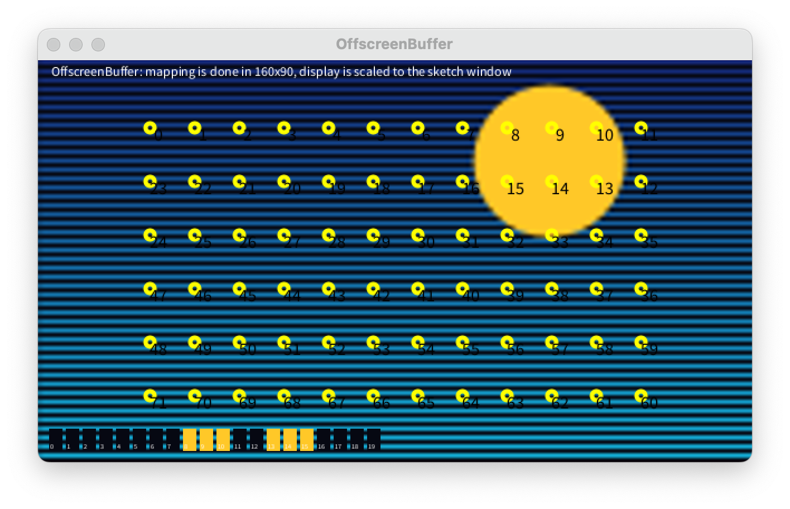
    <div class="gallery-item-label">Offscreen Buffer</div>
  </div>
  <div class="gallery-item">
    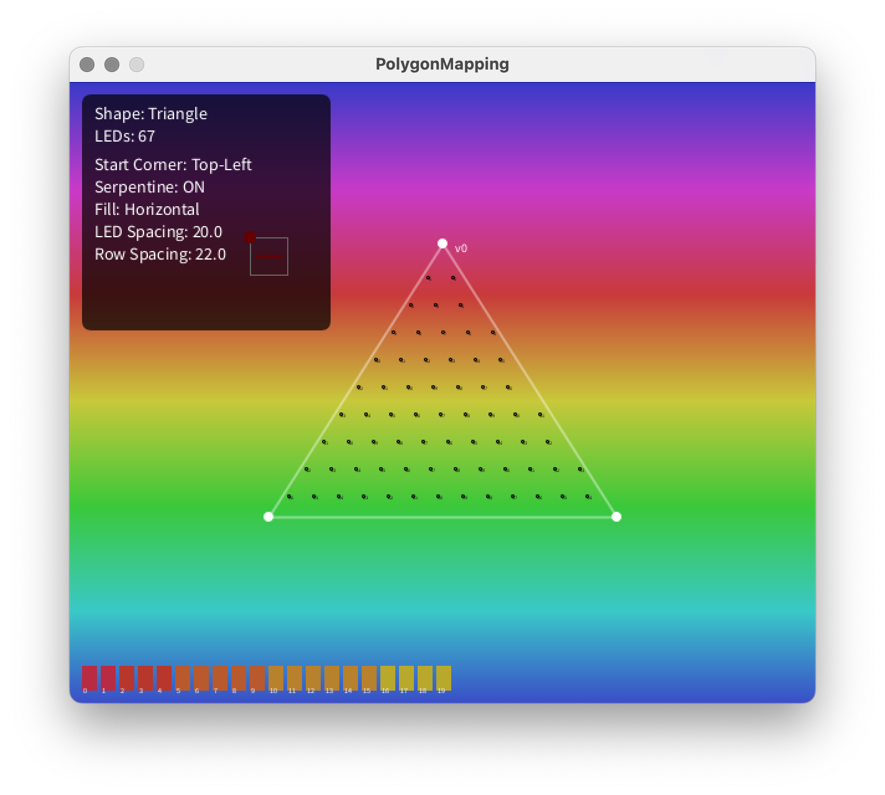
    <div class="gallery-item-label">Polygon Mapping</div>
  </div>
  <div class="gallery-item">
    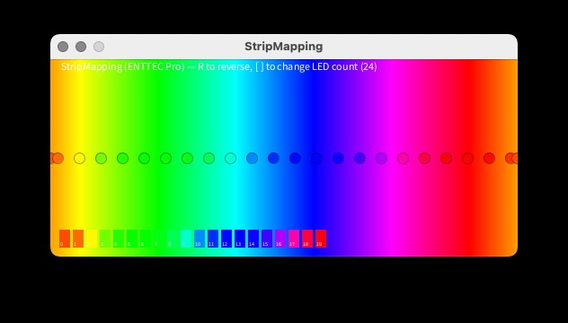
    <div class="gallery-item-label">Interactive Demo</div>
  </div>
</div>

<hr class="section-divider">

<p class="section-label">Demo</p>

[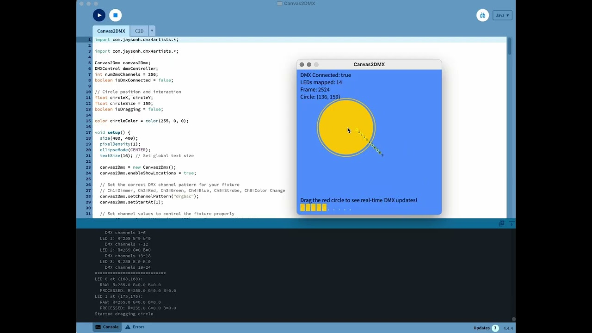](https://youtu.be/-gsM0a_rsXs?si=MXuY8Hiy-LBkyAh_)

<hr class="section-divider">

<div class="studio-credit">
  MIT License &nbsp;·&nbsp; <a href="https://www.jordanshaw.com">Studio Jordan Shaw</a>
</div>
