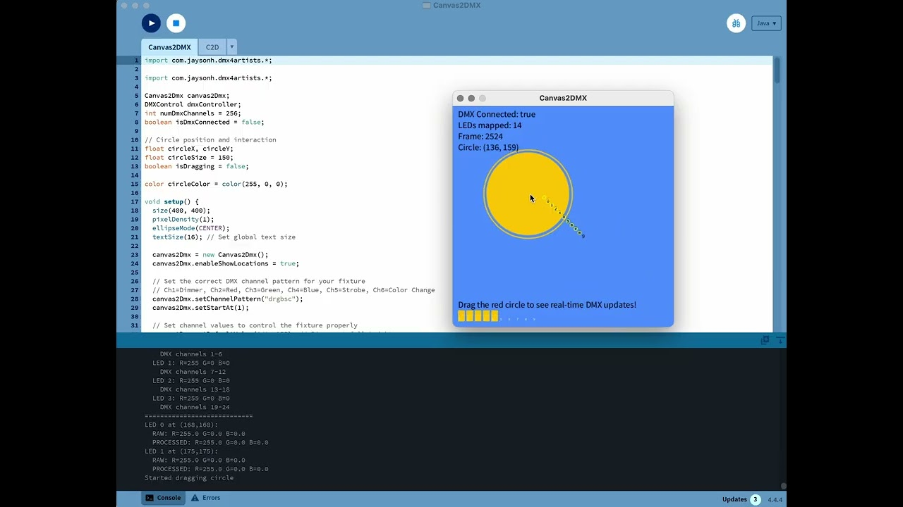

# Canvas2DMX: Map Processing Canvases to DMX



**Canvas2DMX** is a Processing library for mapping pixels from your sketch directly to DMX fixtures.  
It lets you define LED mappings (strips, grids, rings, corners), apply color correction, and send data to any DMX backend (ENTTEC, SP201E, DMX4Artists, or your own).

### **Github Pages link: [Canvas2DMX](https://jshaw.github.io/Canvas2DMX/).**

---

Inspired by [FadeCandy](https://github.com/scanlime/fadecandy) and [Open Pixel Control (OPC)](https://github.com/scanlime/fadecandy/tree/master/examples/Processing) by Micah Elizabeth Scott.

---

## ✨ Features

- Real-time **color sampling** from Processing canvas
- Flexible **LED mapping**: strips, rings, grids, single points, square corners
- **Custom DMX channel patterns** (e.g. `"rgb"`, `"drgb"`, `"drgbsc"`)
- **Default channel values** for dimmer, strobe, color wheel, etc.
- **Gamma correction** and **color temperature adjustment**
- Built-in **visualization** (color bars, LED markers)
- **Agnostic DMX output**: works with DMX4Artists, ENTTEC, SP201E, or any controller via a simple callback
- **Off-screen buffer support** via `setCanvasSize()` for PGraphics workflows
- Ships with **examples** from beginner to interactive

---

## 🎥 Demo Video

[](https://youtu.be/-gsM0a_rsXs?si=MXuY8Hiy-LBkyAh_)

> Click the thumbnail above to watch Canvas2DMX in action on YouTube.

---

## 📦 Installation

1. Download the library release and unzip into your `Processing/libraries/` folder.  
   (After publishing, you’ll be able to install via **Sketch → Import Library → Add Library…**)  

2. Restart Processing. The library will appear under **Sketch → Import Library → Canvas2DMX**.  

3. Explore the included examples via  
   **File → Examples → Contributed Libraries → Canvas2DMX**.  

---

## 🚀 Basic Usage

```java
import io.studiojordanshaw.canvas2dmx.*;
import com.jaysonh.dmx4artists.*;

Canvas2DMX c2d;
DMXControl dmx;

void setup() {
  size(400, 200);
  pixelDensity(1); // important for accurate color sampling on HiDPI screens

  c2d = new Canvas2DMX(this);
  c2d.mapLedStrip(0, 8, width/2f, height/2f, 40, 0, false);

  c2d.setChannelPattern("drgb");   // Dimmer + RGB
  c2d.setDefaultValue('d', 255);   // Dimmer full
  c2d.setStartAt(1);               // Start at DMX channel 1

  try {
    dmx = new DMXControl(0, 512);  // connect to first available DMX device
  } catch (Exception e) {
    println("DMX init failed: " + e.getMessage());
    dmx = null;
  }
}

void draw() {
  background(0);
  ellipse(mouseX, mouseY, 100, 100);

  int[] colors = c2d.getLedColors();
  c2d.visualize(colors);
  c2d.showLedLocations();

  if (dmx != null) {
    // agnostic sender: DMX4Artists, ENTTEC, or your own backend
    c2d.sendToDmx((ch, val) -> dmx.sendValue(ch, val));
  }
}
````

---

## 🖼️ Off-Screen Buffer Support

When sampling from a `PGraphics` buffer instead of the main sketch canvas, use `setCanvasSize()` to tell Canvas2DMX the buffer dimensions. This is essential when your off-screen buffer has different dimensions than your sketch window.

```java
PGraphics buffer;
Canvas2DMX c2d;

void setup() {
  size(800, 600);
  
  // Create an off-screen buffer with different dimensions
  buffer = createGraphics(200, 200);
  
  c2d = new Canvas2DMX(this);
  
  // Tell Canvas2DMX the buffer dimensions (not the sketch window size)
  c2d.setCanvasSize(200, 200);
  
  // Map LEDs relative to the buffer size
  c2d.mapLedStrip(0, 10, 100, 100, 80, 0, false);
}

void draw() {
  // Draw to the off-screen buffer
  buffer.beginDraw();
  buffer.background(0);
  buffer.fill(255, 0, 0);
  buffer.ellipse(mouseX * 0.25, mouseY * 0.33, 50, 50);
  buffer.endDraw();
  
  // Display the buffer on screen (scaled up)
  image(buffer, 0, 0, width, height);
  
  // Sample LED colors from the buffer's pixels
  buffer.loadPixels();
  int[] colors = c2d.getLedColors(buffer.pixels);
  
  c2d.visualize(colors);
}
```

---

## 🧩 Examples

The library ships with 3 examples, found in the Processing IDE under
**File → Examples → Contributed Libraries → Canvas2DMX**.

* **Basics.pde** — Map one LED, sample from canvas, send to DMX
* **StripMapping.pde** — Map a strip of LEDs and animate a gradient
* **InteractiveDemo.pde** — Drag a circle, explore fixture patterns, test DMX values with keyboard controls

Each example will run without hardware (console shows mock DMX output).
When a DMX controller is connected, `sendToDmx(...)` sends live data.

---

### Why use off-screen buffers?

- **Performance**: Sample from a smaller buffer while displaying at full resolution
- **Flexibility**: Keep LED mapping resolution independent from display resolution
- **Effects**: Apply different processing to the DMX output vs. the display

---

## 🔧 LED Mapping Methods

### Single LED

```java
c2d.setLed(0, x, y);
```

### LED Strip

```java
c2d.mapLedStrip(0, 10, 200, 200, 20, radians(45), false);
```

### LED Ring

```java
c2d.mapLedRing(0, 12, 200, 200, 50, 0);
```

### LED Grid

```java
c2d.mapLedGrid(0, 8, 4, 200, 200, 20, 25, 0, true, false);
```

### Square Corners

```java
c2d.mapSquareCorners(0, 200, 200, 100, 45);
```

### Polygon Fill (Auto Spacing)

```java
Canvas2DMX.PolygonFillConfig cfg = new Canvas2DMX.PolygonFillConfig(20, 24)
  .startAt(0)        // 0=TL, 1=TR, 2=BR, 3=BL
  .serpentine(true)  // zigzag
  .horizontal(true) // rows (false = columns)
  .margin(5);

c2d.mapLedPolygon(0, shapeVerts, cfg);
```

### Row Layout (Fixed LEDs per Row)

Use this when each physical LED string has a fixed count per row (tapered gables, triangles, etc.).

```java
int[] rows = { 20, 18, 16, 14, 12, 10 };

Canvas2DMX.RowLayoutConfig rowCfg = new Canvas2DMX.RowLayoutConfig(rows)
  .startAt(0)        // 0=TL, 1=TR, 2=BR, 3=BL
  .serpentine(true)  // zigzag
  .horizontal(true) // rows (false = columns)
  .angleDeg(0)      // row direction angle in degrees
  .rowSpacing(0)    // 0 = evenly distributed across height
  .margin(5);

c2d.setRowLayout(0, shapeVerts, rowCfg);
```

---

## 🎚 DMX Channel Patterns

Configure fixtures with channel layouts:

```java
c2d.setChannelPattern("rgb");      // RGB only
c2d.setChannelPattern("rgbw");     // RGB + White
c2d.setChannelPattern("drgb");     // Dimmer + RGB
c2d.setChannelPattern("drgbsc");   // Dimmer + RGB + Strobe + Color wheel
c2d.setDefaultValue('d', 255);     // Default dimmer value
c2d.setDefaultValue('s', 0);       // Strobe off
```

---

## 🛠 Key Methods

### Core

* `setChannelPattern(String pattern)` — define fixture layout
* `setStartAt(int startAt)` — starting DMX channel
* `setDefaultValue(char channel, int value)` — default values for non-RGB channels
* `getLedColors()` — sample pixels and apply corrections
* `sendToDmx(BiConsumer<Integer,Integer>)` — send DMX via any backend
* `buildDmxFrame(int universeSize)` — generate full DMX frame array
* `setCanvasSize(int width, int height)` | Set custom canvas dimensions for LED mapping (for off-screen buffers) |
* `mapLedPolygon(int start, float[][] verts, PolygonFillConfig cfg)` — fill any polygon with auto spacing
* `mapLedRowLayout(int start, float[][] verts, RowLayoutConfig cfg)` — fixed LEDs per row
* `setRowLayout(int start, float[][] verts, RowLayoutConfig cfg)` — alias of mapLedRowLayout


### Color Correction

* `setResponse(float gamma)` — gamma correction (1.0 = linear, 2.2 typical)
* `setTemperature(float t)` — adjust color temperature (-1 = warm, 1 = cool)
* `setCustomCurve(float[] curve)` — custom correction curve

### Visualization & Debugging

* `showLedLocations()` — draw LED markers on canvas
* `visualize(int[] colors)` — draw sampled LED colors
* `setShowLocations(boolean enabled)` — toggle marker drawing

---

## 🔒 Advanced Features

### Save & Load Settings

You can save the current response/temperature/curve settings to a file and reload them later.  
This is useful for keeping fixture profiles consistent across sketches.

```java
// Save current settings to a file
c2d.saveSettings("mySettings.txt");

// Later, reload them
c2d.loadSettings("mySettings.txt");
```

### Custom Response Curves

Instead of a simple gamma correction, you can define your own brightness curve.  
The curve is an array of values between `0.0` and `1.0` that remap input brightness → output brightness.  
This lets you calibrate your LEDs more precisely than with `setResponse()`.

```java
// Example: nonlinear custom brightness curve
float[] customCurve = {
  0.0,  // off
  0.05, // very dim
  0.2,
  0.5,
  0.8,
  1.0   // full brightness
};

c2d.setCustomCurve(customCurve);
```

---

## ⚠️ Troubleshooting

**Colors wrong or always white**

* Ensure `pixelDensity(1)` in `setup()`
* Use `'l'` key in examples to check LED positions
* Verify your fixture’s DMX channel pattern

**DMX not connecting**

* Try alternate init methods:

  ```java
  new DMXControl(0, 256);                       // device index
  new DMXControl("SERIAL_NUMBER", 256);         // serial
  new DMXControl("/dev/tty.usbserial-XXX", 256); // port path
  ```

**Performance**

* Reduce number of LEDs
* Use `frameRate(30)`
* Disable debug printing

---

## 🗺 Roadmap

* Visualization of DMX channel mapping
* Logging DMX output to file
* Support for RGBW / RGBA fixtures
* Real-time controls (sliders, OSC, MIDI)

---

## 📚 Inspirations

* [FadeCandy](https://github.com/scanlime/fadecandy) by Micah Elizabeth Scott
* [Open Pixel Control](https://github.com/scanlime/fadecandy/tree/master/examples/Processing)

**Original OPC Credit**: Micah Elizabeth Scott, 2013. Released into the public domain.

---

## 📜 License

MIT License © 2025 [Studio Jordan Shaw](https://www.jordanshaw.com/)
